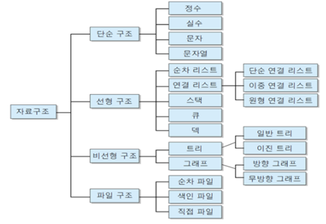
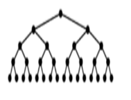
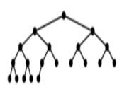
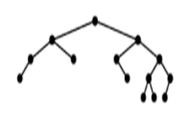
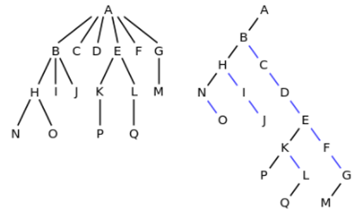
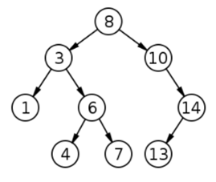

# 자료구조

</img>

## 선형구조와 비선형구조의 분류

+ 선형구조 : 자료들간의 앞뒤 관계가 1:1의 선형관계(열차와 같은 모양)

  + 선형 리스트(Linear List) : 그냥 리스트라고 생각하면 된다
  + 연결 리스트(Linked List) : 각각의 자료가 다른 공간에 저장되어 있지만 서로 연결되어있다
    + 단일 연결 리스트 ( Singly Linked List ) : next만 연결
    + 이중 연결 리스트 ( Doubly Linked List ) : next와 pre 연결
    + 원형(환형) 연결 리스트 ( Circular Linked List ) : 단일연결에서 마지막과 처음을 연결
    + 이중 원형(환형) 연결 리스트 ( Doubly Circular Linked List ) : 이중연결에서 마지막과 처음을 연결
  + 큐(Queue) : 선입선출
  + 데크(Deque) : 스택 + 큐의 모양으로 양쪽이 뚤려있는 통모양

* 비선형구조 : 자료들간의 앞뒤 관계가 1:다 또는 다:다의 관계(포도송이 모양)

  * 트리(Tree) : 폴더방식이 트리라고 생각하면 된다
    * 일반트리(Gerneral) : 모든 일반트리는 이진트리로 변환이 가능하다
    * 이진트리(Binary Tree) : 자식노드가 최대 두 개인 노드로 구성된 트리
      * 정이진트리(full binary tree) : 모든 노드가 꽉 차있는 트리 (배열로 표현가능)
      * 완전이진트리(complete binary tree) : 마지막을 제외하고 모두 차있는 트리 (배열로 표현가능)
      * 균형이진트리(balanced binary tree) 

  * 그래프(Graph)

|정이진트리|완전이진트리|균형이진트리|
|---|---|---|
|</img>|</img>|</img>|

## 일반트리 -> 이진트리 변환

 이진트리 변환" ></img>

1. 임의 노드의 왼쪽 자식은 변환 전 그 노드의 첫 번째 자식이다.(A의 자식 B)
2. 임의 노드의 오른쪽 자식은 변환 전 그 노드의 형제이다.(B의 형제 C)

# 트리순회(Tree traversal)

1. 전위순회(preorder) : 루트 노드에서 시작해서 노드-왼쪽 서브트리-오른쪽 서브트리 순으로 순회하는 방식
2. 중위순회(inorder) : 루트 노드에서 시작해서 왼쪽 서브트리-노드-오른쪽 서브트리 순으로 순회하는 방식
3. 후위순회(postorder) : 루트 노드에서 시작해서 왼쪽 서브트리-오른쪽 서브트리-노드 순으로 순회하는 방식

※ 탐색 알고리즘 (Search algorithm) ※
1. 선형탐색 : 왼쪽에서 오른쪽으로 찾아가는 단순 탐색방법
2. 이진탐색 : 데이터를 정렬한뒤 가운데 번호를 뽑아 비교
3. 해시탐색 : 자료에 특정 힌트?를 딕셔너리처럼 넣어두어 방대한 자료에서 선택의 폭을 줄인뒤 탐색

※ 완전탐색 ※
1. Brute Force : for문과 if문을 이용하여 처음부터 끝까지 탐색하는 방법
2. 비트 마스크 : 이진수 표현을 자료구조로 쓰는 기법 (AND, OR, XOR, SHIFT, NOT)
3. 재귀 함수
4. 순열 : 서로 다른 n개의 원소에서 r개의 중복을 허용하지 않고 순서대로 늘어 놓은 수
5. BFS(너비우선탐색), DFS(깊이우선탐색)

※ 힙(Heap) ※
참고 : https://ratsgo.github.io/data%20structure&algorithm/2017/09/27/heapsort/
최대값과 최솟값을 빠르게 찾아내도록 만들어진 구조
부모노드가 자식노드보다 크다.

 이진트리 변환" ></img>

# heapify : 이진트리를 힙으로 변환시키는 알고리즘

※ 이진탐색 트리(Binary Search Tree) ※
참고 : https://ratsgo.github.io/data%20structure&algorithm/2017/10/22/bst/
이진탐색과 연결리스트를 결합한 구조
왼쪽 자식노드가 가장작고 부모노드가 그 다음으로 크며 오른쪽 자식노드가 가장 큰 값을 가짐

이진탐색트리를 순회할땐 중위순회방식을 사용한다(좌 – 상 - 우)

※ 정렬 ※
참고 : https://gmlwjd9405.github.io/2018/05/10/algorithm-heap-sort.html

1. 선택 정렬 : 주어진 배열에서 최솟값을 찾은 후 그값을 맨 앞값과 교체한다
2. 삽입 정렬 : 두 번째 자료부터 시작하여 그 앞(왼쪽)의 자료들과 비교하여 삽입할 위치를 지정
3. 버블 정렬 : 인접한 두 자료를 비교하여 위치를 교환하고 끝날때까지 반복
4. 셸 정렬 : 정렬해야 할 리스트의 각 k번째 요소를 추출해서 부분 리스트를 만든다.
5. 합병 정렬 : 하나의 리스트를 두 개의 균등한 크기로 분할하고 분할된 리스트를 정렬한 다음, 두 개의 정렬된 부분 리스트를 합치는 방법
6. 퀵 정렬 : 피벗을 기준으로 피벗보다 작은 요소들은 모두 피벗의 왼쪽으로 옮겨지고 피벗보다 큰 요소들은 모두 피벗의 오른쪽으로 옮겨진다.

※ 깊이 우선 탐색(DFS) 과 너비 우선 탐색(BFS) ※

DFS

BFS

